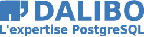
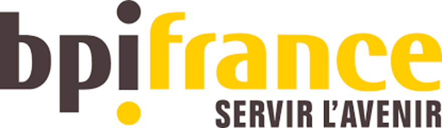
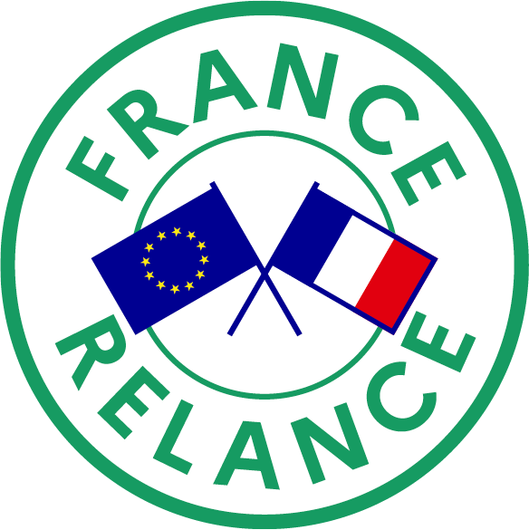
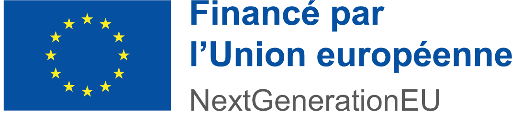

# Sponsors and Contributors

## Sponsors

We gratefully acknowledge the support of our sponsors. Their contributions help make this project possible.
SFCGAL are sponsored by the following organizations:

| Sponsor        | Logo                                                                                          | Web/Description                                                                                  |
|----------------|-----------------------------------------------------------------------------------------------|-------------------------------------------------------------------------------------------------------|
| Oslandia       | {height=123px}                                | [Oslandia](https://oslandia.com)                                                                      |
| Dalibo         | {height=123px}                                | [Dalibo](https://www.dalibo.com)                                                                      |
| BPI France     | {height=123px}                       | [BPI France](https://www.bpifrance.com/)                                                              |
| France 2030    | {height=123px}                          | Funded by the French government as part of France 2030                                     |
| France Relance | {height=123px} {height=123px} | Funded by the European Union - Next Generation EU as part of the France Relance plan |

If you wish to sponsor SFCGAL, you can contact us at [infos@sfcgal.org](mailto:infos@sfcgal.org).

## Contributors

The SFCGAL project would not be possible without the dedicated efforts of its contributors. All contributors are listed in [AUTHORS](AUTHORS):

Thank you to all our contributors for your support and dedication to the project!
