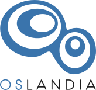
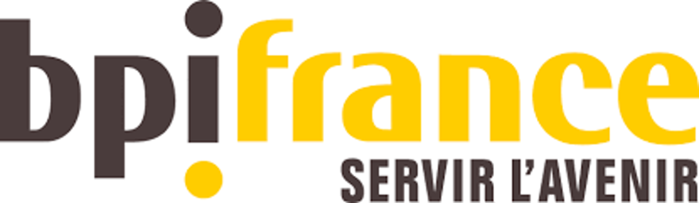
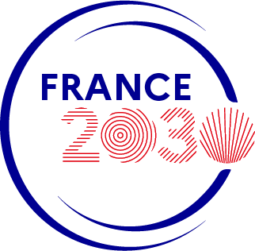
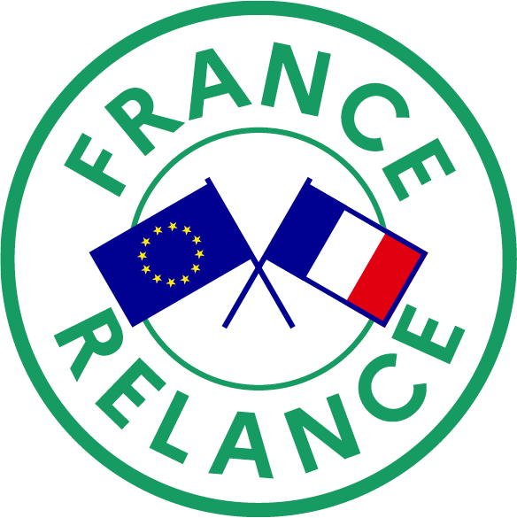
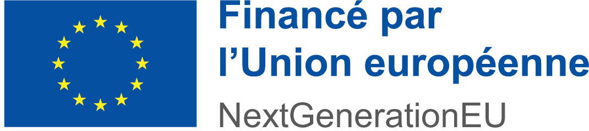

# Sponsors

We gratefully acknowledge the support of our sponsors. Their contributions help make this project possible.  
SFCGAL are sponsored by the following organizations:

<!-- markdownlint-disable MD033 -->

- {height=200px} 

    ----

    Conception and initial development. Hosts core developer and main maintainers.

    [➜ Visit Oslandia](https://oslandia.com)

- {height=200px} 

    ----

    Support and contributions to the project.

    [➜ Visit Dalibo](https://www.dalibo.com)

- {height=200px} __BPI France__

    ----

    Funded by BPI France as part of innovation financing.

    [➜ Visit BPI France](https://www.bpifrance.com)

- {height=100px} __France 2030__

    ----

    Funded by the French government as part of France 2030.

    [➜ Learn more about France 2030](https://www.gouvernement.fr/les-priorites/france-2030)

- {height=200px} {height=200px} __France Relance & EU Next Generation__

    ----

    Funded by the European Union - Next Generation EU as part of the France Relance plan.

    [➜ Learn more about France Relance](https://www.gouvernement.fr/le-plan-france-relance)

<!-- markdownlint-enable MD033 -->

If you wish to sponsor SFCGAL, you can contact us at [infos@sfcgal.org](mailto:infos@sfcgal.org).

## Contributors

The SFCGAL project would not be possible without the dedicated efforts of its contributors. All contributors are listed in [AUTHORS](./authors.md):

Thank you to all our contributors for your support and dedication to the project!

## Funding

The first SFCGAL releases were funded by the European Union (FEDER, related to the [e-PLU project](http://www.e-plu.fr)) and by Oslandia.

We are seeking additional funding to continue development. If interested, contact us at [infos@oslandia.com](mailto:infos@oslandia.com).
